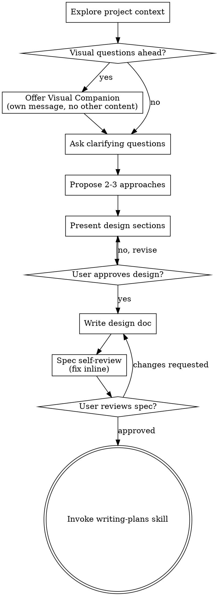

# Brainstorming Ideas Into Designs

Help turn ideas into fully formed designs and specs through natural collaborative dialogue.

Start by understanding the current project context, then ask questions one at a time to refine the idea. Once you understand what you're building, present the design and get user approval.

<HARD-GATE>
Do NOT invoke any implementation skill, write any code, scaffold any project, or take any implementation action until you have presented a design and the user has approved it. This applies to EVERY project regardless of perceived simplicity.
</HARD-GATE>

## Anti-Pattern: "This Is Too Simple To Need A Design"

Every project goes through this process. A todo list, a single-function utility, a config change — all of them. "Simple" projects are where unexamined assumptions cause the most wasted work. The design can be short (a few sentences for truly simple projects), but you MUST present it and get approval.

## Checklist

You MUST create a task for each of these items and complete them in order:

1. **Explore project context** — check files, docs, recent commits
2. **Offer visual companion** (if topic will involve visual questions) — this is its own message, not combined with a clarifying question. See the Visual Companion section below.
3. **Ask clarifying questions** — one at a time, understand purpose/constraints/success criteria
4. **Propose 2-3 approaches** — with trade-offs and your recommendation
5. **Present design** — in sections scaled to their complexity, get user approval after each section
6. **Write design doc** — save to `docs/superpowers/specs/YYYY-MM-DD-<topic>-design.md` and commit
7. **Spec self-review** — quick inline check for placeholders, contradictions, ambiguity, scope (see below)
8. **User reviews written spec** — ask user to review the spec file before proceeding
9. **Transition to implementation** — invoke writing-plans skill to create implementation plan

## Process Flow

**The terminal state is invoking writing-plans.** Do NOT invoke frontend-design, mcp-builder, or any other implementation skill. The ONLY skill you invoke after brainstorming is writing-plans.

## The Process

**Understanding the idea:**

Check project state first (files, docs, recent commits). Assess scope: if request describes multiple independent subsystems, flag for decomposition. For large projects, help decompose into sub-projects with independent pieces. For appropriately-scoped projects, ask questions one at a time (prefer multiple choice, focus on purpose/constraints/success criteria).

**Exploring approaches:**

- Propose 2-3 different approaches with trade-offs
- Present options conversationally with your recommendation and reasoning
- Lead with your recommended option and explain why

**Presenting the design:**

- Once you believe you understand what you're building, present the design
- Scale each section to its complexity: a few sentences if straightforward, up to 200-300 words if nuanced
- Ask after each section whether it looks right so far
- Cover: architecture, components, data flow, error handling, testing
- Be ready to go back and clarify if something doesn't make sense

**Design for isolation and clarity:**

Break system into smaller units with clear purpose, well-defined interfaces, independent testing. For each unit: what does it do, how to use it, what does it depend on? Can consumers understand it without reading internals? Can you change internals without breaking consumers? Smaller, well-bounded units are easier to reason about and edit reliably. Large files signal doing too much.

**Working in existing codebases:**

Explore current structure before proposing changes. Follow existing patterns. Include targeted improvements for problems affecting the work (large files, unclear boundaries). Don't propose unrelated refactoring - stay focused on current goal.

## After the Design

**Documentation:**

- Write the validated design (spec) to `docs/superpowers/specs/YYYY-MM-DD-<topic>-design.md`
  - (User preferences for spec location override this default)
- Use elements-of-style:writing-clearly-and-concisely skill if available
- Commit the design document to git

**Spec Self-Review:**
After writing spec, review for: 1) Placeholders (TBD, TODO, vague requirements) - fix them, 2) Internal consistency (contradictions, architecture mismatch), 3) Scope check (focused enough for single plan or needs decomposition), 4) Ambiguity (pick one interpretation). Fix inline, no re-review needed.

**User Review Gate:**
After the spec review loop passes, ask the user to review the written spec before proceeding:

> "Spec written and committed to `<path>`. Please review it and let me know if you want to make any changes before we start writing out the implementation plan."

Wait for the user's response. If they request changes, make them and re-run the spec review loop. Only proceed once the user approves.

**Implementation:**

- Invoke the writing-plans skill to create a detailed implementation plan
- Do NOT invoke any other skill. writing-plans is the next step.

## Key Principles

- **One question at a time** - Don't overwhelm with multiple questions
- **Multiple choice preferred** - Easier to answer than open-ended when possible
- **YAGNI ruthlessly** - Remove unnecessary features from all designs
- **Explore alternatives** - Always propose 2-3 approaches before settling
- **Incremental validation** - Present design, get approval before moving on
- **Be flexible** - Go back and clarify when something doesn't make sense

## Visual Companion

Browser-based companion for mockups, diagrams, visual options. Available as tool, not mode. Accepting means available for visual questions, not every question.

**Offering:** When anticipating visual content, offer once: "Some of what we're working on might be easier to explain if I can show it in a web browser. I can put together mockups, diagrams, comparisons. This feature is new and can be token-intensive. Want to try it? (Requires opening a local URL)"

**This offer MUST be its own message** - no other content. Wait for response. If declined, proceed text-only.

**Per-question decision:** Use browser for visual content (mockups, wireframes, layout comparisons, architecture diagrams). Use terminal for text content (requirements, conceptual choices, tradeoffs). UI topic ≠ automatic visual question - judge based on whether user would understand better by seeing it.

If accepted, read detailed guide: `skills/brainstorming/visual-companion.md`
