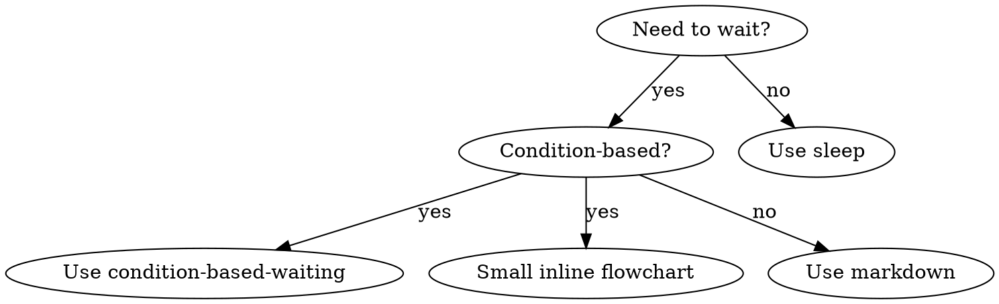

# Advanced Skill Writing Patterns

## Visual Formatting

### Flowcharts

Use flowcharts ONLY for:
- Non-obvious decision points
- Process loops where you might stop too early
- "When to use A vs B" decisions

Never use flowcharts for:
- Reference material → Tables, lists
- Code examples → Markdown blocks
- Linear instructions → Numbered lists
- Labels without semantic meaning (step1, helper2)

Example flowchart:


## Code Examples

**One excellent example beats many mediocre ones**

Choose most relevant language:
- Testing techniques → TypeScript/JavaScript
- Systems programming → Rust
- Data processing → Python

**Make examples runnable:**
```markdown
## Example

```typescript
const result = await conditionBasedWait(
  () => fs.existsSync('/tmp/ready'),
  { timeout: 5000, interval: 100 }
);
```
```

**Inline vs separate files:**
- Inline if: <20 lines, self-contained, illustrates single pattern
- Separate file if: Reusable tool, complex setup, multiple examples

## Testing Workflow

### RED Phase - Write Failing Test
- [ ] Create pressure scenarios (3+ combined pressures for discipline skills)
- [ ] Run scenarios WITHOUT skill - document baseline behavior verbatim
- [ ] Identify patterns in rationalizations/failures

### GREEN Phase - Write Minimal Skill
- [ ] Name uses only letters, numbers, hyphens (no parentheses/special chars)
- [ ] YAML frontmatter with required `name` and `description` fields (max 1024 chars)
- [ ] Description starts with "Use when..." and includes specific triggers/symptoms
- [ ] Description written in third person
- [ ] Keywords throughout for search (errors, symptoms, tools)
- [ ] Clear overview with core principle
- [ ] Address specific baseline failures identified in RED
- [ ] Code inline OR link to separate file
- [ ] One excellent example (not multi-language)
- [ ] Run scenarios WITH skill - verify agents now comply

### REFACTOR Phase - Close Loopholes
- [ ] Identify NEW rationalizations from testing
- [ ] Add explicit counters (if discipline skill)
- [ ] Build rationalization table from all test iterations
- [ ] Create red flags list
- [ ] Re-test until bulletproof

### Quality Checks
- [ ] Small flowchart only if decision non-obvious
- [ ] Quick reference table
- [ ] Common mistakes section
- [ ] No narrative storytelling
- [ ] Supporting files only for tools or heavy reference

### Deployment
- [ ] Commit skill to git and push to your fork (if configured)
- [ ] Consider contributing back via PR (if broadly useful)

## Discovery Workflow

How future Claude finds your skill:

1. **Encounters problem** ("tests are flaky")
2. **Searches skills** (matches description)
3. **Finds SKILL** (description matches)
4. **Scans overview** (is this relevant?)
5. **Reads patterns** (quick reference table)
6. **Loads example** (only when implementing)

**Optimize for this flow** - put searchable terms early and often.

## The Bottom Line

**Creating skills IS TDD for process documentation.**

If you skip the testing phase, you're writing documentation, not creating a skill. The difference is that skills have been validated to actually change agent behavior.